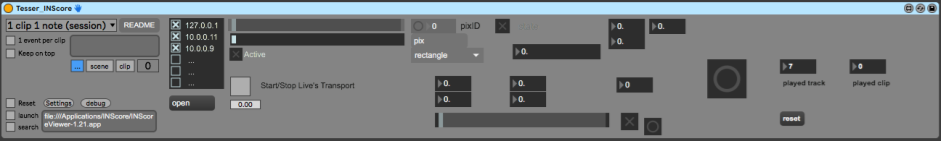

This Patch is part of the [TESSER environment](https://bitbucket.org/AdrianArtacho/tesserakt/src/master/).

# Tesser_INScore

This M4L device processes messages send to (and received from) INScore, anywhere in the local network.

## MODUS 1: 1 Clip / 1 Note

This is the first of the different modi. It only works in *Session View*, and requires each *cue box* to be entered as a single note within a midiclip. By default, the name of the clip will be displayed on the screen. 

### How do I use it?

* Slice midi into individual clips, with one note per clip.
* Space before/after the note is advisable, to give enough warning time to the performer.
* Stack the clips one after the other in the track where the M4L device lives.
* Set MODUS 1 in the settings
* (the toggle for "Automatic NEXT clip" should now be ON)
* Set the global quantization to NONE

____

# To-Do

- Documentation

- 
